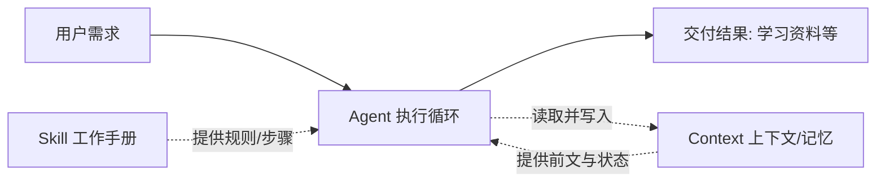

# Agent / 上下文（Context） / Skill 三者关系

> 本文件是 `concept-relationship.html` 的纯文本版本，便于在 GitHub / 编辑器直接阅读。

## 1. 一句话角色比喻

- **Skill = 工作手册**：规定好“这类任务怎么做”，把经验固化成可复用方法。
- **Context（上下文）= 短期记忆 / 工作台**：保存当前这次任务的全过程信息，保证 Agent 不丢前文。
- **Agent = 执行员工**：拿着手册、依托记忆，一步步把任务做完。

## 2. 关系流程图（Mermaid）

文字版：用户需求 →（加载）Skill +（读写）Context → Agent 执行循环 → 交付结果。

## 3. 三者对比

| 维度 | Skill | 上下文 Context | Agent |
| --- | --- | --- | --- |
| 本质 | 可复用的方法 / 知识包 | 一次任务可见的文本范围 | 自主执行循环的系统 |
| 角色 | 说明书 | 记忆 / 工作台 | 执行者 |
| 存在位置 | 仓库 / 用户目录的 SKILL.md | 模型输入（token 窗口） | 运行时（代码 + 模型） |
| 是否跨会话 | 是（随仓库保存） | 否（默认不跨会话） | 否（每次运行新建） |
| 与另两者的关系 | 被 Agent 加载 | 被 Agent 读写 | 加载 Skill、读写 Context |

## 4. 重点：上下文如何影响 Agent 的工作

Agent 的每一步决策都依赖“当前上下文”里的信息：系统设定、历史步骤、工具返回、用户新要求。上下文就是 Agent 的**工作台**。

如果上下文长度不足或被不当截断，Agent 会**丢失前面的指令和中间结果**——即使 Skill 写得再好，也会因为“看不见需求”而跑偏、重复或中断。因此 Agent 设计里常做上下文管理：压缩历史、用检索把相关片段拉回窗口、把长期信息存外部库。

**结论**：Skill 决定“怎么干”，Context 决定“Agent 此刻还能记得什么”；两者共同决定 Agent 能不能把事干成。

## 5. 重点：Skill 如何沉淀可复用任务知识

没有 Skill 时，每学会一件事都只停留在一次聊天里，下次要重新教。Skill 把“这次怎么把 Agent / 上下文这类概念讲清楚”的框架与步骤写成 `SKILL.md`，于是：

- **结构化**：明确适用场景、输入、生成步骤、输出结构、来源与自检要求；
- **可复用**：下次只要换一个概念名（如 RAG），同一套框架就产出一份新资料；
- **可迭代 / 可共享**：随仓库提交、做版本管理，团队成员也能直接用。

**结论**：Skill 是“把一次性对话经验”升级为“项目级可复用能力”的载体，而 Agent + 上下文则是这套能力真正跑起来的执行环境。

## 6. 个人理解小结

三者是“**能力（Skill）→ 状态（Context）→ 执行（Agent）**”的闭环：Skill 提供方法，Context 提供当下可用的信息，Agent 把两者结合起来自主推进任务。理解它们的关系后，我不再把“让 AI 帮我做事”当成一句提示词，而是当成“定义好手册、管理好上下文、交给 Agent 执行”的工程问题——本仓库的 Skill 与三份资料，就是这套认知的落地。
